# 竞品分析 Agent 协作系统 — Agent 逻辑文档

## 整体架构

系统基于 **LangGraph** 构建，采用 **两阶段 StateGraph 编排**，分别对应竞品发现和报告生成两个阶段。两端共享同一个 `AgentState` 类型定义，通过 SQLite 持久化实现状态跨阶段传递。

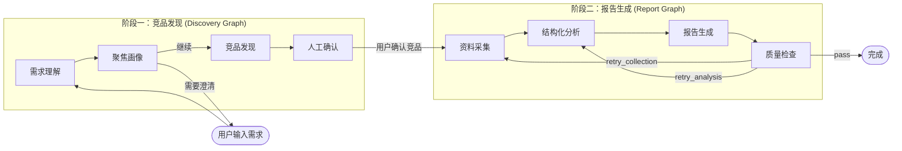

---

## 阶段一：竞品发现 Graph

### Graph 定义

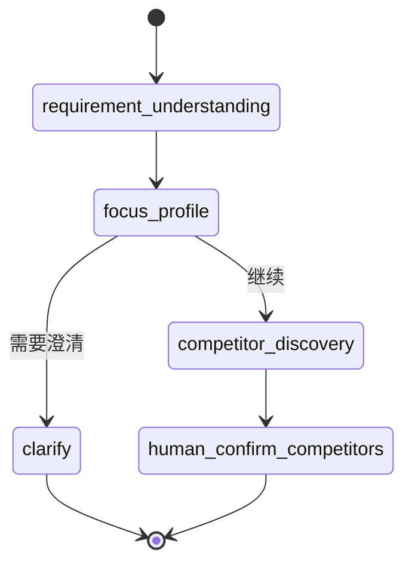

### 节点详解

#### 1. requirement_understanding（需求理解）

**职责**：将用户自然语言描述解析为结构化需求，提取领域、目标产品、分析维度等信息。

**逻辑**：
- 若 `state.requirement` 已存在（恢复场景），跳过解析，直接透传
- 否则调用 `llm.understand_requirement(user_requirement)` 提取结构化需求

**输入**：`state.user_requirement`（原始需求文本）
**输出**：`state.requirement`（结构化需求字典）

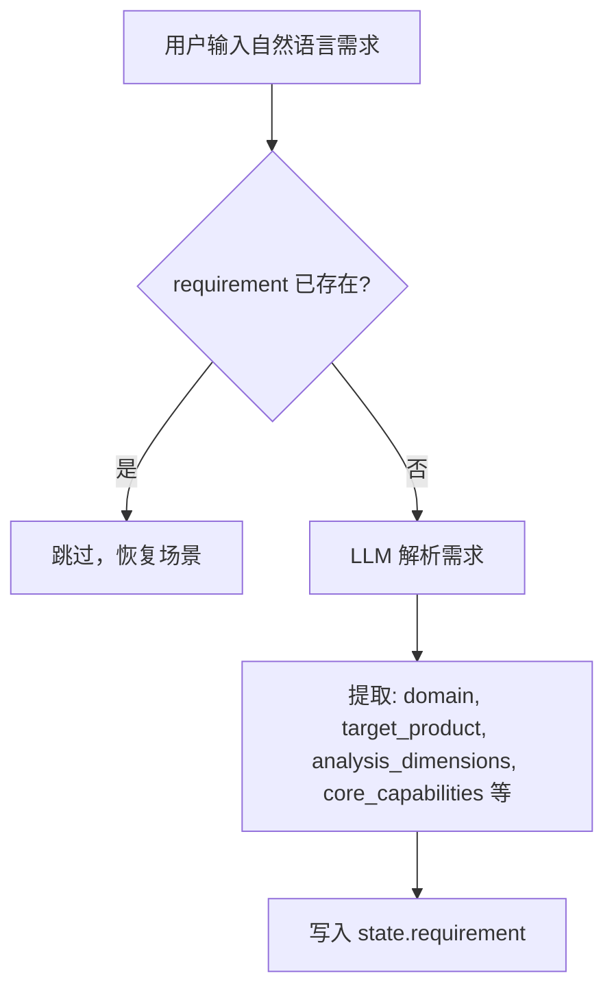

#### 2. focus_profile（聚焦画像）

**职责**：从用户需求中提取明确关注点和推断关注点，必要时生成澄清问题让用户补充侧重点。

**逻辑**：
- 调用 `llm.extract_focus_profile()` 提取聚焦画像
- 规范化输出：`explicit_focuses`（明确关注点）、`inferred_focuses`（推断关注点）、`assumptions`（假设）
- 若 LLM 判断需要澄清（`clarification_needed=true`），生成 `clarifying_question`

**路由判断**（`focus_profile_route`）：
- 需要澄清 → 返回 `"clarify"`，Graph 终止，前端展示问题等待用户回答
- 不需要澄清 → 返回 `"continue"`，进入竞品发现

**输入**：`state.requirement`、`state.user_requirement`
**输出**：`state.requirement.focus_profile`（含 `explicit_focuses`、`inferred_focuses`、`assumptions`、`clarifying_question`）

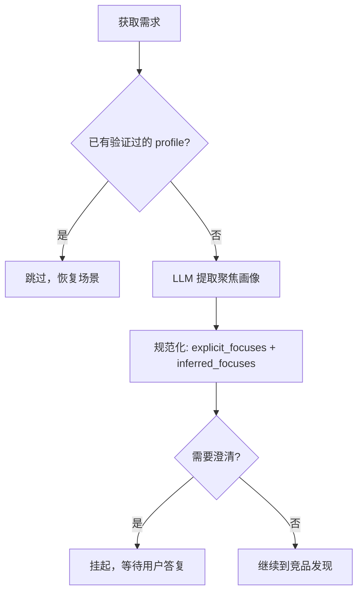

#### 3. competitor_discovery（竞品发现）

**职责**：这是最复杂的节点，负责搜索、理解目标产品，发现并筛选候选竞品。

**核心流程**：

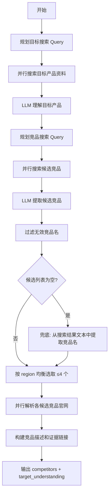

**关键子步骤**：

1. **目标 Query 规划**（`_plan_target_queries`）：根据是否有聚焦画像的 `query_terms` 生成搜索 query
2. **目标理解**（`llm.understand_target`）：基于搜索结果归纳目标产品的定位、用户、核心能力
3. **竞品 Query 规划**（`_plan_competitor_queries`）：基于目标画像 + 聚焦关注点生成竞品发现 query
4. **竞品提取**（`llm.extract_competitors`）：LLM 从搜索结果中识别候选竞品
5. **过滤与去重**：排除无效名称（如通用词、中文停用词、目标产品本身），按全球/国内区域均衡选取
6. **官网解析**（`_resolve_product_result`）：并行搜索每个候选竞品的官网，匹配已知域名
7. **兜底机制**（`_extract_fallback_competitors`）：若 LLM 过滤后为空，直接从搜索结果标题/摘要中通过正则提取竞品名

**输入**：`state.requirement`、LLM Provider、Search Provider
**输出**：`state.target_understanding`、`state.competitors`、`state.target_search_results`、`state.competitor_search_results`

#### 4. human_confirm_competitors（人工确认竞品）

**职责**：设置状态为 `waiting_for_human`，等待用户在 UI 中确认/移除/添加竞品。

**逻辑**：简单地将 `state.status` 设为 `"waiting_for_human"`，前端展示竞品列表供用户交互。

**输入**：`state.competitors`
**输出**：`state.status = "waiting_for_human"`

---

## 阶段二：报告生成 Graph

### Graph 定义

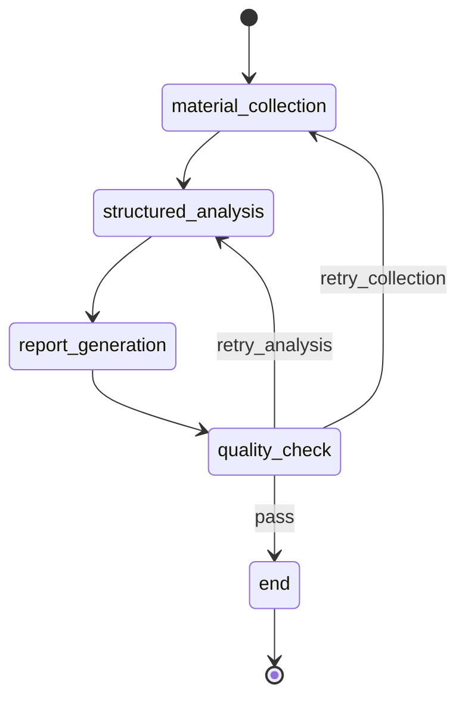

### 节点详解

#### 1. material_collection（资料采集）

**职责**：为已确认的竞品按维度规划检索 Quart（搜索单元），执行搜索、分类来源、抽取结构化证据。

**核心流程**：

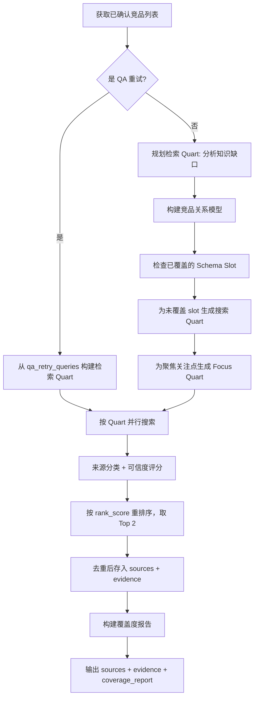

**关键概念**：

- **Quart（检索单元）**：为每个竞品的每个知识维度生成一个搜索单元，包含 query、目标 slot、偏好来源类型、成功标准等
- **Schema Slot**：7 个知识槽位 — `relationship_evidence`、`positioning`、`core_features`、`pricing`、`user_feedback`、`market_signal`、`risk_opportunity`
- **关系模型**（`_build_relationship_model`）：为每个竞品构建 relation_claim、competed_need、overlap_points，用于生成精准的搜索 query
- **来源分类**（`_classify_source`）：将搜索结果分为 13 种类型（官网、评价站、电商页、社区讨论等），每种类型有不同可信度权重
- **覆盖度检查**（`_build_coverage_report`）：检查 4 大分析维度（产品定位、核心功能、价格与商业模式、用户评价与痛点）的证据覆盖情况

**产品类型自适应**：
- **软件/SaaS**：搜索官网、文档、定价页、G2/Capterra 评价
- **商品/硬件**：搜索京东/天猫商品页、电商评价、小红书/B站测评

**输入**：`state.selected_competitors`、`state.requirement`、Search Provider
**输出**：`state.sources`、`state.evidence`、`state.coverage_report`

#### 2. structured_analysis（结构化分析）

**职责**：对每个竞品调用 LLM 进行结构化分析，输出定位、用户、功能、定价、优劣势、机会点等维度的分析结果。

**核心流程**：

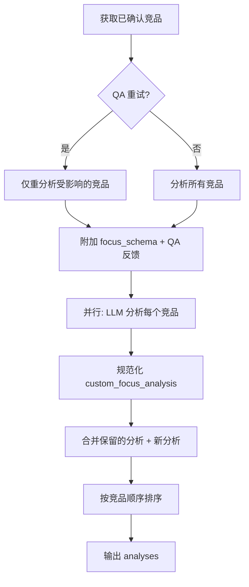

**分析维度**：
- `positioning`：产品定位
- `target_users`：目标用户
- `core_features`：核心功能
- `pricing_summary`：定价策略
- `strengths`：优势
- `weaknesses`：劣势/痛点
- `opportunities`：机会点
- `custom_focus_analysis`：个性化关注点分析（基于 focus_profile）

**QA 重试支持**：若 `qa_retry_analysis_ids` 存在，仅重新分析受影响的竞品，保留其他竞品的分析结果。

**输入**：`state.selected_competitors`、`state.evidence`、`state.requirement`、LLM Provider
**输出**：`state.analyses`

#### 3. report_generation（报告生成）

**职责**：将分析结果和证据整合为 Markdown 报告，附引用标注。

**核心流程**：

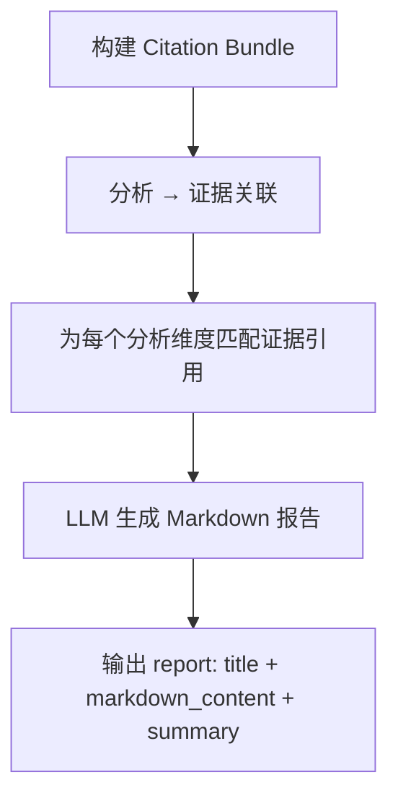

**Citation Bundle**：为每个竞品的每个分析维度（positioning、target_users、core_features、pricing、strengths、weaknesses、opportunities、custom_focus）匹配对应的证据引用（source_reference_id、source_title、source_url），确保报告中的每个结论都有据可查。

**输入**：`state.analyses`、`state.evidence`、`state.sources`、`state.requirement`、LLM Provider
**输出**：`state.report`

#### 4. quality_check（质量检查 + 反馈循环）

**职责**：这是系统的核心质量保障机制，对报告进行多维度评分，最多支持 3 轮反馈循环。

**核心流程**：

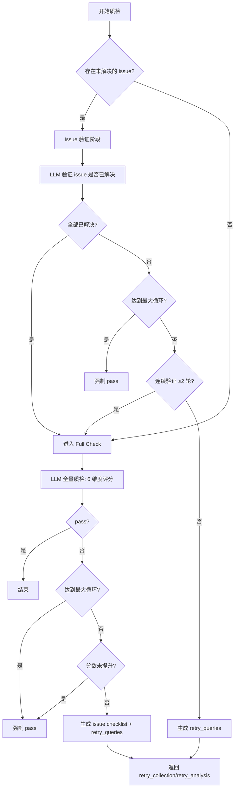

**六维度评分体系**：

| 维度 | 权重 | 说明 |
|------|------|------|
| `evidence_grounding` | 0.25 | 证据基础：结论是否有公开来源支撑 |
| `citation_accuracy` | 0.15 | 引用准确性：引用是否准确对应所述结论 |
| `schema_completeness` | 0.20 | 结构完整性：分析维度是否完整 |
| `coverage_gaps` | 0.20 | 覆盖缺口：是否有重要信息缺失 |
| `cross_competitor_consistency` | 0.10 | 竞品一致性：竞品间分析标准是否一致 |
| `factual_plausibility` | 0.10 | 事实合理性：结论是否合理 |

**决策逻辑**（`_derive_decision`）：
- 若 issue 维度属于 `evidence_grounding` 或 `coverage_gaps` → `retry_collection`（重新采集资料）
- 若所有维度分数 ≥ 0.7 → `pass`
- 否则 → `retry_analysis`（重新分析，不重新采集）

**强制 Pass 保护**：
1. 反馈循环达到 `MAX_FEEDBACK_LOOPS`（3 轮）
2. 当前分数 ≤ 上一轮分数（无改进）
3. Issue 验证连续 2 轮未解决 → 降级为 Full Check

**路由**（`qa_route`）：
- `"pass"` → `END`，任务完成
- `"retry_collection"` → 回到 `material_collection`，带上 `qa_retry_queries` 和 `qa_retry_guidance_map`
- `"retry_analysis"` → 回到 `structured_analysis`，带上 `qa_retry_guidance_map` 和 `qa_retry_analysis_ids`

**输入**：`state.report`、`state.analyses`、`state.evidence`、LLM Provider
**输出**：`state.qa_result`、`state.qa_issue_checklist`、`state.feedback_loop_count`

---

## AgentState（共享状态）

系统使用 `TypedDict` 定义全局状态，在 LangGraph 节点间流转：

```python
class AgentState(TypedDict, total=False):
    # 核心输入
    run_id: str
    user_requirement: str

    # 阶段一输出
    requirement: dict[str, Any]
    target_understanding: dict[str, Any]
    target_search_results: list[dict]
    competitor_search_results: list[dict]
    competitors: list[dict]

    # 阶段二输入
    selected_competitors: list[dict]

    # 阶段二中间产物
    sources: list[dict]
    evidence: list[dict]
    analyses: list[dict]

    # 阶段二输出
    report: dict[str, str]

    # 质检反馈循环
    qa_result: dict[str, Any]
    qa_retry_queries: list[dict]
    qa_retry_guidance_map: dict[str, str]
    qa_retry_analysis_ids: list[str]
    qa_report_guidance: str
    qa_issue_checklist: list[dict]
    qa_issue_verification_count: int
    feedback_loop_count: int
```

状态流转总览：

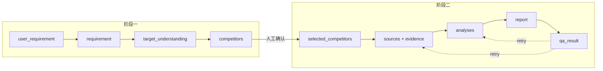

---

## 追踪系统（Trace）

每个节点的执行都会被记录到 `agent_traces` 表中，用于前端展示实时进度和调试。

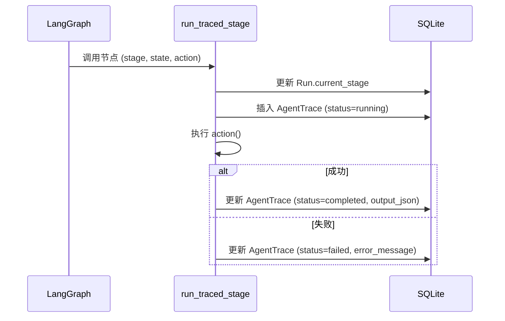

**进度追踪**（`record_progress_trace`）：在 `competitor_discovery` 和 `material_collection` 等长耗时节点中，细分步骤通过 `progress` 回调记录中间状态，前端可实时展示搜索进度。

---

## 服务层编排

`run_service.py` 负责协调两个 Graph 的执行和状态持久化：

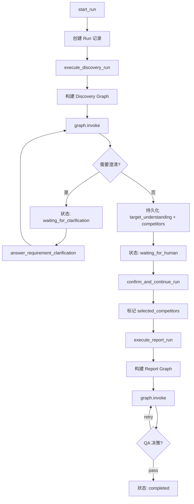

---

## LLM 接口

Agent 系统通过抽象接口 `LLMProvider` 调用 LLM，支持多种 Provider：

| 方法 | 用途 | 调用节点 |
|------|------|----------|
| `understand_requirement` | 解析用户需求为结构化数据 | requirement_understanding |
| `extract_focus_profile` | 提取聚焦画像和关注点 | focus_profile |
| `understand_target` | 基于搜索结果理解目标产品 | competitor_discovery |
| `extract_competitors` | 从搜索结果中识别候选竞品 | competitor_discovery |
| `analyze_competitor` | 对单个竞品进行结构化分析 | structured_analysis |
| `generate_report` | 生成 Markdown 报告 | report_generation |
| `qa_check_report` | 全量质检评分 | quality_check |
| `qa_verify_issues` | 验证已修复 issue | quality_check |

支持的 Provider：
- **mock**：本地确定性输出，用于开发和测试
- **ark**：火山引擎 Ark（豆包模型）
- **openai / openai_compatible**：任意 OpenAI Chat Completions 兼容端点

---

## 关键数据流总结

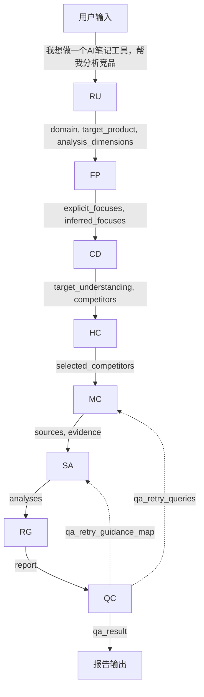