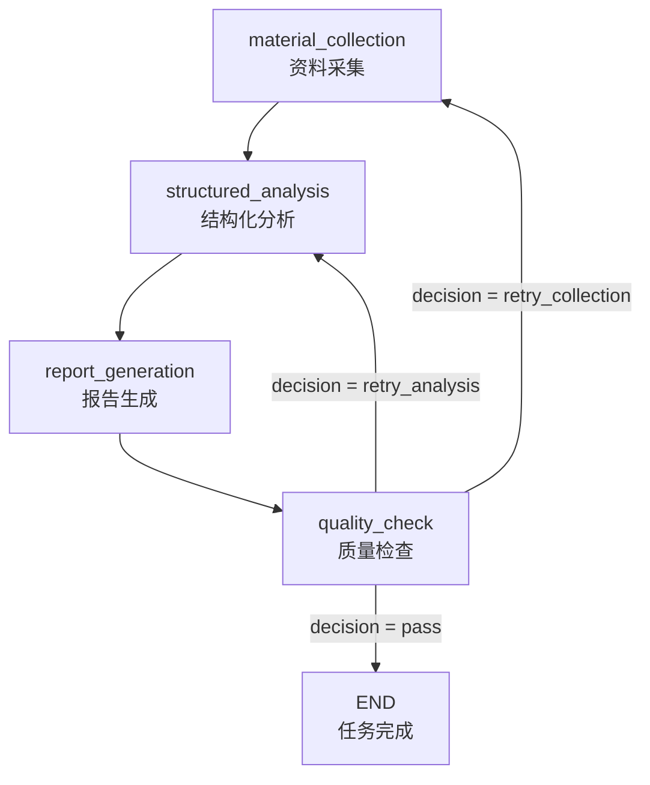

# 质检 Agent 与反馈回退流程

本文档描述当前代码中的质检流程，包括质检 Agent 能看到的信息、输出字段、系统对质检结果的二次处理，以及回退到 `material_collection` 或 `structured_analysis` 后的实际行为。

本文档以当前实现为准，主要对应以下文件：

- `backend/app/agents/graph.py`
- `backend/app/agents/nodes/quality_check.py`
- `backend/app/agents/nodes/material_collection.py`
- `backend/app/agents/nodes/structured_analysis.py`
- `backend/app/providers/llm/ark.py`
- `backend/app/providers/llm/mock.py`
- `backend/app/services/run_service.py`

## 1. 总体流程

用户确认竞品后，报告生成图从 `material_collection` 开始执行：



完整的正常路径是：

```text
首次资料采集
  -> 首次结构化分析
  -> 生成初始报告
  -> 第 1 轮质检
  -> 通过并完成
```

如果第 1 轮质检要求重新采集：

```text
首次资料采集
  -> 首次结构化分析
  -> 生成初始报告
  -> 第 1 轮质检
  -> 使用质检 Agent 输出的 retry_queries 重新采集
  -> 对受影响竞品重新分析
  -> 重新生成报告
  -> 第 2 轮质检
  （如果仍未通过，可继续回退）
  -> ...
  -> 第 3 轮质检通过或强制通过并完成
```

如果第 1 轮质检要求重新分析：

```text
首次资料采集
  -> 首次结构化分析
  -> 生成初始报告
  -> 第 1 轮质检
  -> 对质检问题涉及的竞品重新分析
  -> 重新生成报告
  -> 第 2 轮质检
  （如果仍未通过，可继续回退）
  -> ...
  -> 第 3 轮质检通过或强制通过并完成
```

当前配置：

| 配置 | 当前值 | 含义 |
|---|---|---:|
| `QA_PASS_THRESHOLD` | `0.7` | 质检通过分数线。 |
| `MAX_FEEDBACK_LOOPS` | `3` | 最多执行 3 轮质检。首次质检计为第 1 轮，因此最多发生 2 次回退。 |
| `COLLECTION_DIMENSIONS` | `evidence_grounding`、`coverage_gaps` | 被系统视为可能需要重新采集资料的质检维度。 |

## 2. 进入质检节点时的状态

`quality_check` 位于 `report_generation` 之后。进入质检前，内存中的 `AgentState` 至少已经包含：

| 状态字段 | 内容 |
|---|---|
| `report` | 最新一轮生成的报告，包含 `title`、`summary`、`markdown_content`。 |
| `analyses` | 当前每个竞品的结构化分析。 |
| `evidence` | 当前累计的全部结构化证据。 |
| `sources` | 当前累计的全部资料来源。 |
| `feedback_loop_count` | 已完成的质检轮数。首次质检前不存在或为 `0`。 |
| `qa_result` | 上一轮质检结果。首次质检前不存在。 |

质检节点调用：

```python
llm.qa_check_report(
    report,
    analyses,
    evidence,
    sources,
)
```

## 3. 质检 Agent 能看到的信息

### 3.1 System Prompt

调用 Ark LLM 时，系统消息固定为：

````text
你是严谨的竞品分析多 Agent 系统。必须只输出纯 JSON，
不要包含 ```json 代码块标记，不要输出任何解释文字。
````

调用参数中的 `temperature` 为 `0.2`。

### 3.2 User Prompt 的输入内容

质检 Agent 并不会看到完整的任务状态，而是看到代码从报告、分析、证据和来源中整理出的摘要。

| Prompt 区块 | Agent 实际能看到的信息 | 截断或数量限制 |
|---|---|---|
| 报告内容 | `report.markdown_content` | **完整报告，无截断。** |
| 分析摘要 | 每个竞品的名称、定位、定价摘要、关联证据数量 | **无字符截断**；会遍历全部分析。 |
| 证据摘要 | 证据对应竞品、维度、置信度、摘要 | 只取前 `30` 条证据；每条摘要只取前 `150` 字符。 |
| 来源列表 | 来源编号、标题、来源类型 | 只取前 `20` 条来源；标题只取前 `60` 字符。 |
| 质检维度说明 | 6 个质检维度的名称和判断标准 | 完整提供。 |
| 决策规则 | 分数权重、通过阈值、回退判断规则 | 完整提供。 |
| 输出 JSON Schema | 要求输出的字段和嵌套结构 | 完整提供。 |
| issues 生成规则 | 一条 issue 只对应一个竞品的硬约束 | 完整提供。 |
| retry_queries 规则 | query 数量、语言、长度和示例 | 完整提供。 |

分析摘要的单行结构如下：

```text
- 竞品={competitor_name}；
  定位={positioning 完整内容}；
  定价={pricing_summary 完整内容}；
  证据数={evidence_ids_json 中的 ID 数量}
```

证据摘要的单行结构如下：

```text
- 竞品={related_product}；
  维度={related_dimension}；
  置信度={confidence}；
  摘要={summary 前 150 字符}
```

来源摘要的单行结构如下：

```text
- [{reference_id}] {title 前 60 字符} ({source_type})
```

### 3.3 质检 Agent 看不到的信息

当前 Prompt 没有直接提供以下内容：

- 用户原始需求 `user_requirement`
- 需求理解结果 `requirement`
- 报告的 `title` 和 `summary`
- 证据的 `id`、原文引用 `quote`、来源 URL
- 超过前 30 条的证据
- 来源 URL、来源正文、可信度分数、分类原因
- 超过前 20 条的来源
- 上一轮质检结果和上一轮分数

上一轮分数只由 `quality_check_node` 在 LLM 返回后用于系统侧决策，不会放入质检 Agent 的 Prompt。

## 4. 六个质检维度

质检 Prompt 要求 Agent 对以下 6 个维度分别打 `0.0-1.0` 分：

| 维度 | Prompt 中的含义 | 权重 |
|---|---|---:|
| `evidence_grounding` | 分析结论是否有证据支撑，是否存在幻觉内容。 | `0.25` |
| `citation_accuracy` | 报告中的 `[[N]](URL)` 引用是否指向真实来源。 | `0.15` |
| `schema_completeness` | 每个竞品的 7 个分析字段是否都有实质内容。 | `0.20` |
| `coverage_gaps` | 每个竞品的产品定位、核心功能、价格与商业模式、用户评价与痛点四个核心维度是否有充足证据。 | `0.20` |
| `cross_competitor_consistency` | 各竞品的分析深度是否一致。 | `0.10` |
| `factual_plausibility` | 报告是否存在明显不合理的事实内容。 | `0.10` |

Prompt 要求 Agent 按上述权重计算 `overall_score`。代码不会重新计算加权平均，只会把 Agent 返回的 `overall_score` 限制在 `0.0-1.0` 范围内。

## 5. 质检 Agent 原始输出字段

Ark LLM 被要求输出以下 JSON：

```json
{
  "overall_score": 0.0,
  "dimension_scores": {
    "evidence_grounding": 0.0,
    "citation_accuracy": 0.0,
    "schema_completeness": 0.0,
    "coverage_gaps": 0.0,
    "cross_competitor_consistency": 0.0,
    "factual_plausibility": 0.0
  },
  "decision": "pass | retry_collection | retry_analysis",
  "retry_instructions": "具体的改进指导",
  "retry_queries": [],
  "issues": []
}
```

### 5.1 顶层输出字段

| 字段 | 类型 | 含义 | 后续用途 |
|---|---|---|---|
| `overall_score` | `number` | 六个质检维度的总体得分，预期范围为 `0.0-1.0`。 | 决定是否通过；Ark 返回后会被限制到 `0.0-1.0`。 |
| `dimension_scores` | `object` | 六个维度各自的得分。 | 当前仅由 Prompt 要求输出，后续流程不读取、不落库、API 不返回。 |
| `decision` | `string` | Agent 建议的下一步：`pass`、`retry_collection` 或 `retry_analysis`。 | 系统会根据分数、轮数和问题内容再次修正，最终由 `qa_route` 路由。 |
| `retry_instructions` | `string \| null` | 面向人类阅读的整体改进指导。 | 会写入质检结果表，并在 `retry_collection` 时可通过 `qa_retry_guidance_map` 的默认值传到后续分析节点。 |
| `retry_queries` | `array` | 需要重新采集时使用的精确搜索 query。 | 仅当最终决策为 `retry_collection` 时复制到 `AgentState.qa_retry_queries`。 |
| `issues` | `array` | 发现的问题列表。 | 用于推断回退类型、定位需要重分析的竞品、构建按竞品分组的 guidance map，并展示在前端。 |

### 5.2 `dimension_scores` 字段

| 字段 | 类型 | 含义 |
|---|---|---|
| `evidence_grounding` | `number` | 证据支撑度得分。 |
| `citation_accuracy` | `number` | 引用准确性得分。 |
| `schema_completeness` | `number` | Schema 完整度得分。 |
| `coverage_gaps` | `number` | 覆盖完整度得分。 |
| `cross_competitor_consistency` | `number` | 跨竞品一致性得分。 |
| `factual_plausibility` | `number` | 事实合理性得分。 |

当前代码不校验这些分数、不用它们计算 `overall_score`，也不持久化它们。

### 5.3 `retry_queries` 单项字段

| 字段 | 类型 | 含义 | 使用方式 |
|---|---|---|---|
| `competitor_name` | `string` | 要补充采集的竞品名称。 | 回退到资料采集后，用名称匹配已选择竞品。支持精确匹配和小写匹配。匹配失败时该 query 被忽略。 |
| `slot` | `string` | 要补充的知识槽位。 | 映射为资料采集中的分析维度，并决定偏好的来源类型和成功标准。缺失时默认为 `core_features`。 |
| `query` | `string` | 直接提交给搜索引擎的搜索关键词。 | 回退采集时原样使用，不再由系统的固定模板重新生成。空字符串会被忽略。 |

Prompt 允许的 `slot`：

| `slot` | 对应资料维度 |
|---|---|
| `core_features` | 核心功能 |
| `pricing` | 价格与商业模式 |
| `positioning` | 产品定位 |
| `user_feedback` | 用户评价与痛点 |
| `market_signal` | 产品定位。该 slot 的语义目标是市场信号，但当前 `SCHEMA_SLOT_DIMENSIONS` 将其归入"产品定位"。 |
| `risk_opportunity` | 用户评价与痛点。该 slot 的语义目标是风险与机会，但当前 `SCHEMA_SLOT_DIMENSIONS` 将其归入"用户评价与痛点"。 |
| `relationship_evidence` | 竞争关系 |

### 5.4 `issues` 单项字段

| 字段 | 类型 | 含义 | 后续用途 |
|---|---|---|---|
| `dimension` | `string` | 问题所属质检维度。 | `evidence_grounding` 和 `coverage_gaps` 被视为采集类问题；其他维度被视为分析类问题。 |
| `severity` | `string` | 严重程度：`critical`、`major`、`minor`。 | 当采集类问题为 `critical` 时，系统可推断为 `retry_collection`。 |
| `competitor_name` | `string` | **单个竞品名**，或 `report`、`system`。Prompt 硬约束：严禁填入多个竞品名（如 `"A、B"` 或 `"全部竞品"`）。 | 用于构建按竞品分组的 guidance map，以及定位需要重新分析的竞品。 |
| `description` | `string` | 问题描述。 | 落库并展示给用户。 |
| `fix_suggestion` | `string` | 修复建议。 | 按竞品分组后注入到每个竞品对应的分析 Agent Prompt。 |

**issues 生成规则（Prompt 约束）：**

- 每条 issue 必须对应且只对应一个竞品。如果一个问题同时影响多个竞品（如"A 和 B 都缺少用户评价"），必须拆成多条独立的 issue，每条只关联一个竞品。
- 对于 cross_competitor_consistency 类问题，每条 issue 只需列出受影响的一方（如"A 的分析深度高于 B"，应拆为一条针对 A 的 issue 和一条针对 B 的 issue）。

## 6. 系统对 Agent 输出的二次处理

质检 Agent 的输出不会直接决定跳转。`quality_check_node` 会进行以下处理。

### 6.1 计算轮次

```python
feedback_count = state.get("feedback_loop_count", 0) + 1
```

| 执行时机 | `feedback_count` |
|---|---:|
| 第一次执行质检 | `1` |
| 发生一次回退后再次质检 | `2` |
| 发生两次回退后再次质检 | `3` |

### 6.2 决策修正规则

系统按以下顺序修正 `decision`：

1. 如果 `feedback_count >= MAX_FEEDBACK_LOOPS`（当前为 3）：
   - 设置 `forced_pass = true`
   - 强制把 `decision` 改为 `pass`
2. 否则，如果 `overall_score >= 0.7` 且 Agent 返回的不是 `pass`：
   - 把 `decision` 改为 `pass`
3. 否则，如果 `overall_score < 0.7` 但 Agent 返回 `pass`：
   - 如果存在 `evidence_grounding` 或 `coverage_gaps` 的 `critical` 问题，改为 `retry_collection`
   - 否则改为 `retry_analysis`
4. 否则，如果存在上一轮分数，且本轮分数没有提高：
   - 设置 `forced_pass = true`
   - 把 `decision` 改为 `pass`

当前 `MAX_FEEDBACK_LOOPS = 3`，因此第 3 轮会命中"达到最大轮次并强制通过"。第 2 轮如果分数未提高，会命中"分数未提高时强制通过"的分支。

### 6.3 系统生成的 `qa_result`

Agent 原始输出经过处理后，系统生成：

| 字段 | 类型 | 含义 |
|---|---|---|
| `overall_score` | `number` | Agent 返回的总体分数。 |
| `decision` | `string` | 系统修正后的最终决策。 |
| `retry_instructions` | `string \| null` | Agent 原始返回的改进指导。 |
| `issues` | `array` | Agent 返回的问题列表。 |
| `iteration` | `number` | 当前质检轮次。 |
| `forced_pass` | `boolean` | 是否由系统强制改为通过。 |
| `previous_score` | `number \| null` | 上一轮质检分数。 |

### 6.4 根据最终决策写入的回退状态

| 最终决策 | 写入 `AgentState` 的字段 | 内容 |
|---|---|---|
| `pass` | 无额外回退字段 | 图执行结束。 |
| `retry_collection` | `qa_retry_queries` | Agent 返回的 `retry_queries`；未返回时为 `[]`。 |
| `retry_collection` | `qa_retry_guidance_map` | `dict[str, str]`，按 `competitor_name` 分组。每个竞品包含其 issue 的 `fix_suggestion`；若有全局 `retry_instructions` 则拼接在前。 |
| `retry_analysis` | `qa_retry_analysis_ids` | 根据非采集类 issue 中的 `competitor_name` 找到需要重分析的竞品 ID。 |

`retry_analysis` 的竞品定位规则：

1. 只考虑 `dimension` 不属于 `evidence_grounding`、`coverage_gaps` 的 issue。
2. 忽略 `competitor_name` 为 `report`、`system` 或 `null` 的 issue。
3. 用 issue 中的竞品名称精确匹配当前分析中的 `competitor_name`。
4. 如果没有匹配到明确竞品，则重新分析全部竞品。

### 6.5 `qa_retry_guidance_map` 的构建

`_build_retry_guidance_map` 遍历所有 issue，按 `competitor_name` 分组：

- 忽略 `competitor_name` 为 `report`、`system` 或空的 issue
- 每个竞品累积其所有 issue 的 `fix_suggestion`（格式：`"- {fix_suggestion}\n"`）
- 若有全局 `retry_instructions`，则拼接在每个竞品 feedback 的最前面

**关键改进：之前的实现是全局单字符串，所有重分析竞品看到相同的 feedback。现在每个竞品只注入自己相关 issue 的修复建议，不同竞品之间互不干扰。**

## 7. 回退到 `material_collection`

### 7.1 首次资料采集做什么

首次进入 `material_collection` 时，状态中没有 `qa_retry_queries`，因此执行：

```python
_plan_material_queries(...)
  -> _plan_retrieval_quarts(...)
  -> _build_retrieval_quart(...)
```

首次采集的 query 不是 LLM 动态生成，而是系统根据以下信息使用固定模板规划：

- 产品类型：`software` 或 `commodity`
- 竞品类型：直接竞品、间接竞品、替代方案、相邻产品
- 竞品语言或区域：`global` 或 `china`
- 需要覆盖的知识槽位
- 已有证据覆盖情况
- 目标产品与竞品的竞争关系模型

首次运行时通常还没有已有证据，因此会按竞品类型规划一组预定义槽位 query。

| 竞品类型 | 默认优先槽位 |
|---|---|
| 直接竞品 | `relationship_evidence`、`positioning`、`core_features`、`pricing`、`user_feedback`、`market_signal` |
| 间接竞品 | `relationship_evidence`、`positioning`、`core_features`、`user_feedback`、`pricing`、`market_signal` |
| 替代方案 | `relationship_evidence`、`positioning`、`user_feedback`、`risk_opportunity`、`pricing`、`core_features` |
| 相邻产品 | `relationship_evidence`、`positioning`、`core_features`、`market_signal`、`risk_opportunity`、`pricing` |

例如，全球软件直接竞品的固定模板包括：

```text
{target_name} vs {competitor_name} features pricing reviews alternative
{competitor_name} official website product positioning features
{competitor_name} docs help features integrations API
{competitor_name} pricing plans enterprise
{competitor_name} reviews pros cons G2 Capterra Reddit
{competitor_name} news launch funding product update
```

每个检索 Quart 还会包含：

- `target_slot` 和对应分析维度
- 偏好的来源类型
- 要避免的来源类型
- 优先级
- `limit = 4`
- 成功标准
- 竞争关系假设、竞争需求和重叠点

### 7.2 质检回退采集做什么

质检回退后，如果 `qa_retry_queries` 非空，节点不再运行首次采集的模板规划，而是执行：

```python
_build_retry_product_queries(
    selected_competitors,
    qa_retry_queries,
    requirement,
)
```

核心区别：

| 行为 | 首次资料采集 | 质检回退资料采集 |
|---|---|---|
| query 来源 | 系统按产品类型、竞品类型、槽位和语言使用固定模板生成。 | 直接使用质检 Agent 输出的 `retry_queries[].query`。 |
| 采集目标 | 为每个竞品覆盖预定义的多个知识槽位。 | 只处理质检 Agent 指定且能匹配到竞品的 query。 |
| `slot` 来源 | 系统按优先槽位自动选择。 | 使用 `retry_queries[].slot`；缺失时默认为 `core_features`。 |
| 竞品选择 | 所有已选竞品。 | 通过 `retry_queries[].competitor_name` 匹配；没有 query 的竞品被保留但跳过搜索。 |
| 已有资料 | 首次通常为空。 | 保留此前的全部 `sources` 和 `evidence`，在其上增量追加。 |
| 采集轮次标记 | `collection_iteration = 0`。 | 第一次回退时 `collection_iteration = 1`，依此类推。 |

回退 query 会被包装成标准检索 Quart。以下字段由系统补充，而不是由质检 Agent 直接提供：

- `competitor_id`
- `product_type`
- `competitor_type`
- `relation_claim`
- `competed_need`
- `overlap_points`
- `dimension`
- `query_locale`
- `preferred_source_types`
- `avoid_source_types`
- `priority = high`
- `limit = 4`
- `success_criteria`

### 7.3 首次采集与回退采集共同执行的操作

无论首次采集还是质检回退采集，搜索执行阶段相同：

1. 每个 query 调用搜索 Provider，最多召回 `4` 条。
2. 按来源类型、维度匹配、偏好来源和竞争关系进行分类与重排序。
3. 每个 query 只处理排序后的前 `2` 条结果。
4. `sources` 按"竞品 ID + URL"在内存中去重。
5. 为搜索结果生成结构化 `evidence`。
6. 重新计算资料覆盖报告。
7. 将新增来源和证据持久化。

回退采集结束后，图不会直接回到质检，而是继续执行：

```text
material_collection
  -> structured_analysis
  -> report_generation
  -> quality_check
```

## 8. 回退采集后进入 `structured_analysis`

重新采集后，状态中仍然保留：

- `qa_retry_queries`
- `qa_retry_guidance_map`（按竞品分组的 guidance）
- 原有分析 `analyses`
- 累计的全部证据 `evidence`

`structured_analysis` 会从 `qa_retry_queries[].competitor_name` 推导受影响的竞品 ID：

```text
retry_queries 中能匹配到的竞品
  -> 重新分析

其他竞品
  -> 保留已有分析
```

对受影响竞品进行重新分析时：

- 使用该竞品当前累计的全部证据，而不只是新采集证据。
- 通过 `qa_retry_guidance_map.get(competitor["name"])` 查找该竞品的专属 feedback。
- 将 feedback 注入分析 Agent Prompt 的 `_qa_feedback` 字段。
- 生成新的分析 ID。
- 设置 `analysis_iteration = feedback_loop_count`，第一次回退时为 `1`。

注入分析 Agent Prompt 的内容格式为：

```text

【质检反馈——请务必改进以下问题】
{该竞品专属的 fix_suggestion 列表，可能带有全局 retry_instructions 前缀}

请特别注意：上次分析存在上述问题，请务必在本次分析中改进。
```

**关键改进：之前 `qa_retry_guidance` 是全局单字符串，所有重分析竞品看到相同内容（如"微信: 补充用户评价; 钉钉: 搜索定价信息; 飞书: 补全核心功能"），每个 LLM 调用需要自行从中挑选相关部分。现在改为 `qa_retry_guidance_map`（`dict[竞品名, feedback]`），每个竞品只收到属于自己的 issue 修复建议，互不干扰，且节省 token。**

## 9. 回退到 `structured_analysis`

### 9.1 首次结构化分析做什么

首次进入 `structured_analysis` 时：

- `qa_retry_analysis_ids` 不存在。
- `qa_retry_queries` 不存在。
- `qa_retry_guidance_map` 不存在。
- `existing_analyses` 为空。

因此节点会并行分析全部已选竞品，最多同时执行 `4` 个分析任务。

每个竞品的分析 Agent 能看到：

| 输入 | 内容 |
|---|---|
| 竞品名称 | `competitor.name` |
| 竞品描述 | `competitor.description` 前 `300` 字符 |
| 已采集证据 | 当前竞品前 `12` 条证据 |
| 单条证据信息 | `evidence_id`、维度、来源 URL、摘要前 `300` 字符 |
| 质检反馈 | 首次分析没有该区块 |

分析 Agent 输出定位、目标用户、核心功能、定价、优势、劣势、机会点、竞争关系类型、竞争关系原因和重叠维度。

节点随后：

- 为分析生成新的 `analysis.id`。
- 设置 `analysis_iteration = 0`。
- 用该竞品当前全部证据 ID 重写 `evidence_ids_json`。

### 9.2 直接质检回退重分析做什么

当质检最终决策为 `retry_analysis` 时，`quality_check_node` 写入 `qa_retry_analysis_ids`。

`structured_analysis` 的行为：

1. 仅选择 `qa_retry_analysis_ids` 中的竞品重新执行分析 Agent。
2. 未受影响竞品保留已有分析，不重新调用 LLM。
3. 重新分析仍使用该竞品当前已有的全部证据。
4. 为重新分析结果生成新 ID。
5. 设置 `analysis_iteration = feedback_loop_count`，第一次回退时为 `1`。
6. 合并"保留的旧分析"和"新分析"，再继续生成新报告。

### 9.3 `retry_collection` 后与 `retry_analysis` 后的分析对比

`retry_collection` 会设置 `qa_retry_guidance_map`，因此重新采集后的结构化分析会为每个竞品注入专属的质检改进指导。

但是，当前直接 `retry_analysis` 分支只设置 `qa_retry_analysis_ids`，没有设置 `qa_retry_guidance_map`。因此直接回退到 `structured_analysis` 时：

- 能根据 issue 定位并重跑相关竞品。
- 仍使用原有证据。
- 但分析 Agent Prompt 中不会出现质检反馈区块。
- 除了再次调用模型和生成新的分析 ID 外，输入内容通常与首次分析基本一致。

这是当前代码的实际行为，不是理想设计描述。

### 9.4 首次分析与质检回退分析对比

| 行为 | 首次结构化分析 | `retry_collection` 后的结构化分析 | 直接 `retry_analysis` |
|---|---|---|---|
| 分析竞品范围 | 全部已选竞品 | 通常只分析 `retry_queries` 涉及的竞品 | 只分析非采集类 issue 涉及的竞品；无法定位时分析全部 |
| 使用证据 | 首次采集得到的全部竞品证据 | 当前累计的全部证据，包括新增证据 | 原有全部证据，没有新增采集 |
| 是否注入质检指导 | 否 | **是，使用 `qa_retry_guidance_map` 按竞品注入专属 feedback** | 当前实现不注入 |
| `analysis_iteration` | `0` | 第一次回退时为 `1` | 第一次回退时为 `1` |
| 未受影响分析 | 不存在 | 保留 | 保留 |

## 10. 重新生成报告与再次质检

无论回退到 `material_collection` 还是 `structured_analysis`，完成结构化分析后都会重新执行 `report_generation`。

报告生成使用：

- 当前完整 `analyses`
- 当前完整 `evidence`
- 当前完整 `sources`
- 系统构建的 `citation_bundle`

每次执行 `report_generation` 都会新增一条报告记录：

| 报告生成时机 | `iteration` |
|---|---:|
| 首次质检前生成的报告 | `0` |
| 第一次回退后重新生成的报告 | `1` |
| 第二次回退后重新生成的报告 | `2` |

新报告生成后再次进入 `quality_check`。由于当前 `MAX_FEEDBACK_LOOPS = 3`，第 3 轮质检无论分数和问题如何，都会被系统改为 `pass`。

## 11. 质检结果持久化与 API

每次质检结束后，系统都会新增一条 `qa_results` 记录，并更新 `runs.feedback_loop_count`。

### 11.1 `qa_results` 实际落库字段

| 字段 | 来源 |
|---|---|
| `run_id` | 当前任务 ID |
| `iteration` | `qa_result.iteration` |
| `overall_score` | `qa_result.overall_score` |
| `decision` | 系统修正后的 `qa_result.decision` |
| `issues_json` | `qa_result.issues` JSON |
| `retry_instructions` | Agent 原始返回的改进指导 |
| `created_at` | 数据库生成 |

以下信息当前不会落库：

- `dimension_scores`
- `retry_queries`
- `qa_retry_guidance_map`
- `forced_pass`
- `previous_score`
- `qa_retry_analysis_ids`

### 11.2 查询 API

```http
GET /api/runs/{run_id}/qa/results
```

API 按 `iteration` 升序返回：

- `id`
- `run_id`
- `iteration`
- `overall_score`
- `decision`
- `issues`
- `retry_instructions`
- `created_at`

由于 `forced_pass` 没有落库和返回，前端无法区分"真实通过"和"达到最大轮次后强制通过"。

### 11.3 `feedback_loop_count` 暴露到前端

`feedback_loop_count` 已通过 `RunResponse` API 暴露给前端。前端使用该字段判断当前是否处于质检回退阶段：

- `feedback_loop_count = 0`：首次执行的报告生成阶段之前，不展示报告
- `feedback_loop_count > 0`：处于质检回退中（即报告至少已生成过一次），此时即使 `current_stage` 为 `material_collection` 或 `structured_analysis`，也继续展示已有报告

## 12. Ark 失败时的 Mock 质检回退

Ark 调用失败、返回空内容、返回非法 JSON 或非对象 JSON 时，会使用 `MockLLMProvider.qa_check_report` 的结果。

Mock 质检规则：

1. 统计每个竞品的证据数量。
   - `0` 条证据：生成 `coverage_gaps / critical` 问题。
   - `1-2` 条证据：生成 `coverage_gaps / major` 问题。
2. 检查定价分析。
   - 定价为空、包含"未涉及"或包含"Mock"时，生成 `schema_completeness / major` 问题。
3. 检查报告中的引用编号。
   - 如果 `[[N]]` 中的 `N` 大于来源数量，生成 `citation_accuracy / minor` 问题。
4. 计算分数：

```text
overall_score = max(0.3, 1.0 - issue_count * 0.12)
```

5. 决策：
   - 分数不低于 `0.7`：`pass`
   - 存在严重覆盖问题：`retry_collection`
   - 其他情况：`retry_analysis`

Mock 也会为覆盖问题和定价问题生成 `retry_queries`。

## 13. 当前实现需要特别注意的行为

1. 最多可发生 2 次质检回退。第 3 轮质检会无条件强制通过。
2. `dimension_scores` 虽然是质检 Prompt 的输出字段，但系统不读取、不校验、不落库。
3. 直接 `retry_analysis` 当前不会把 `retry_instructions` 或 issue 修复建议注入分析 Agent Prompt。
4. `retry_collection` 如果没有有效 `retry_queries`，资料采集节点会因为 `qa_retry_queries` 为空而回到常规模板规划，而不是精确补采。
   - 此时后续结构化分析也无法从 `retry_queries` 定位受影响竞品，并且不会注入 `qa_retry_guidance_map`。
5. `retry_queries[].competitor_name` 无法匹配已选竞品时，对应 query 会被忽略。
6. 质检 Agent 看到的是完整报告全文和不截断的分析摘要，因此它对报告内容和分析质量有全面判断；
   但证据摘要和来源列表仍有限制（前 30 条/前 20 条 + 截断），超过了这些范围的信息不在 Agent 视野内。
7. 每次报告生成发生在质检之前。因此即使报告质检不通过，数据库中也会先保存该轮报告版本。
8. 结构化分析表只保留当前分析结果；重新分析时旧分析会被替换，但 `analysis_iteration` 会标记当前结果来自哪一轮。
9. `qa_route` 只识别 `retry_collection` 和 `retry_analysis`。如果 Agent 返回其他未识别的 `decision`，且系统二次处理没有将其改写，路由会按结束处理。
10. **每条 issue 的 `competitor_name` 必须是单个竞品名**（Prompt 硬约束），这使得 `_build_retry_guidance_map` 和 `_identify_retry_analyses` 可以精确匹配竞品。
11. **`qa_retry_guidance_map` 按竞品名精确注入 feedback**，每个竞品的分析 Agent 只看到与自己相关的问题修复建议，不再看到无关竞品的问题。
