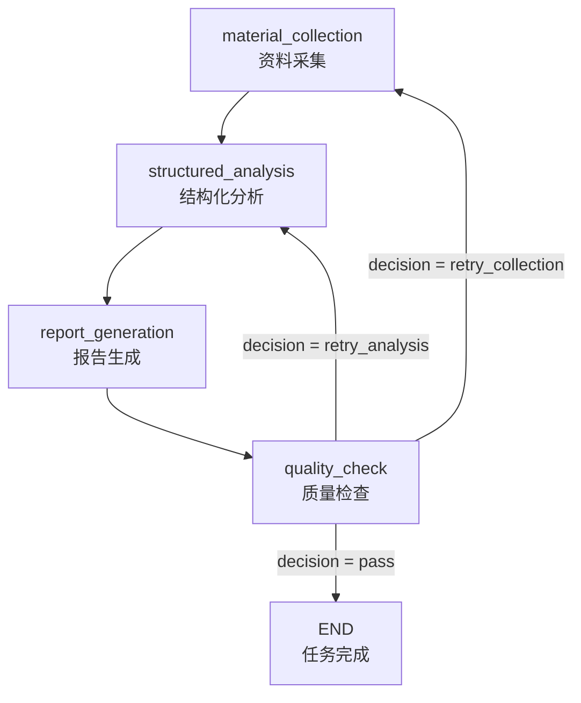

# 质检 Agent 与反馈回退流程

本文档描述当前代码中的质检流程，包括质检 Agent 能看到的信息、输出字段、系统对质检结果的二次处理、Issue Checklist 增量校验机制，以及回退到 `material_collection` 或 `structured_analysis` 后的实际行为。

本文档以当前实现为准，主要对应以下文件：

- `backend/app/agents/graph.py`
- `backend/app/agents/nodes/quality_check.py`
- `backend/app/agents/nodes/material_collection.py`
- `backend/app/agents/nodes/structured_analysis.py`
- `backend/app/agents/nodes/report_generation.py`
- `backend/app/providers/llm/ark.py`
- `backend/app/providers/llm/base.py`
- `backend/app/providers/llm/mock.py`
- `backend/app/services/run_service.py`
- `backend/app/agents/state.py`
- `backend/app/db/models.py`
- `backend/app/schemas/qa.py`

## 1. 总体流程

用户确认竞品后，报告生成图从 `material_collection` 开始执行：



质检节点内部有两个阶段，按是否有未解决的 issue 自动切换：

```
进入 quality_check_node
  │
  ├─ checklist 无 open issues → full_check（LLM 6维全检）
  │
  └─ checklist 有 open issues → issue_verification（LLM 复核历史问题是否已解决）
       │
       ├─ 全部解决 → 转入 full_check
       ├─ 部分未解决 → 直接 retry（不跑 full_check）
       ├─ 连续 2 次未全部解决 → 强制转入 full_check
       └─ 系统轮次达到 MAX → forced_pass
```

完整的正常路径是：

```text
首次 material_collection
  -> 首次 structured_analysis
  -> 生成初始报告
  -> 第 1 轮质检 (full_check)
  -> 通过并完成
```

如果第 1 轮 full_check 要求重新采集：

```text
首次 material_collection
  -> 首次 structured_analysis
  -> 生成初始报告
  -> 第 1 轮质检 (full_check) — 发现问题, 写入 checklist
  -> retry_collection — 使用质检 Agent 输出的 retry_queries 重新采集
  -> 对受影响竞品重新分析
  -> 重新生成报告
  -> 第 2 轮质检 (issue_verification) — 复核 checklist 中的 open issues
  （如果仍未全部解决且未达到上限 → retry）
  -> ...
```

当前配置：

| 配置 | 当前值 | 含义 |
|---|---|---:|
| `QA_PASS_THRESHOLD` | `0.7` | 每个维度必须 >= 0.7 才算通过。 |
| `MAX_FEEDBACK_LOOPS` | `3` | 最多执行 3 轮 full_check。issue_verification 不消耗此配额，但受独立上限约束（连续 2 次且 `raw_count + 1 >= MAX` 时强制 pass）。 |
| `COLLECTION_DIMENSIONS` | `evidence_grounding`、`coverage_gaps` | 被系统视为可能需要重新采集资料的质检维度。 |
| `DIMENSION_SCORE_WEIGHTS` | 0.25 / 0.15 / 0.2 / 0.2 / 0.1 / 0.1 | 系统按此权重自行计算 `overall_score`，不信任 LLM 返回的加权总分。 |

## 2. 进入质检节点时的状态

`quality_check` 位于 `report_generation` 之后。进入质检前，内存中的 `AgentState` 至少已经包含：

| 状态字段 | 内容 |
|---|---|
| `report` | 最新一轮生成的报告，包含 `title`、`summary`、`markdown_content`。 |
| `analyses` | 当前每个竞品的结构化分析。 |
| `evidence` | 当前累计的全部结构化证据。 |
| `sources` | 当前累计的全部资料来源。 |
| `feedback_loop_count` | 已完成的 full_check 轮数。首次不存在或为 `0`。 |
| `qa_result` | 上一轮质检结果。首次不存在。 |
| `qa_issue_checklist` | 跨轮次追踪的 issue 清单。首次不存在或为空。 |
| `qa_issue_verification_count` | 连续 issue_verification 未全部解决的次数。首次不存在或为 `0`。 |

质检节点根据 `qa_issue_checklist` 中是否有 `status=open` 的 issue 决定执行哪条路径。

## 3. 质检 Agent 能看到的信息

### 3.1 System Prompt

调用 Ark LLM 时，系统消息固定为：

````text
你是严谨的竞品分析多 Agent 系统。必须只输出纯 JSON，
不要包含 ```json 代码块标记，不要输出任何解释文字。
````

### 3.2 full_check（首次全检）的输入内容

| Prompt 区块 | Agent 实际能看到的信息 | 截断或数量限制 |
|---|---|---|
| 报告内容 | `report.markdown_content` | **完整报告，无截断。** |
| 分析摘要 | 每个竞品的名称、定位、定价摘要、关联证据数量 | **无字符截断**；会遍历全部分析。 |
| 证据摘要 | 证据对应竞品、维度、置信度、摘要 | 只取前 `30` 条证据；每条摘要只取前 `150` 字符。 |
| 来源列表 | 来源编号、标题、来源类型 | 只取前 `20` 条来源；标题只取前 `60` 字符。 |
| 质检维度说明 | 6 个质检维度的名称和判断标准 | 完整提供。 |
| 决策规则 | 分数权重、通过阈值、回退判断规则 | 完整提供。 |
| 输出 JSON Schema | 要求输出的字段和嵌套结构 | 完整提供。 |
| issues 生成规则 | 一条 issue 只对应一个竞品的硬约束 | 完整提供。 |
| retry_queries 规则 | query 数量、语言、长度和示例 | 完整提供。 |

分析摘要的单行结构如下：

```text
- 竞品={competitor_name}；
  定位={positioning 完整内容}；
  定价={pricing_summary 完整内容}；
  证据数={evidence_ids_json 中的 ID 数量}
```

### 3.3 issue_verification（复核）的输入内容

当上一轮 full_check 发现了 issues 且未被全部解决时，本轮不使用 full_check 的 prompt。改为调用 `qa_verify_issues`，仅关注历史 open issues 是否已被解决：

| Prompt 区块 | 内容 |
|---|---|
| 历史未解决 issues | 当前 checklist 中所有 `status=open` 的 issue（JSON 格式，含 id、dimension、severity、competitor_name、description、fix_suggestion） |
| 报告内容 | `report.markdown_content`（完整，无截断） |
| 分析摘要 | 与 full_check 一致（完整，无截断） |
| 证据摘要 | 前 40 条（比 full_check 多 10 条）；摘要截取前 180 字符 |
| 来源列表 | 前 25 条（比 full_check 多 5 条） |

质检复核 Agent 的 prompt 强调：

- 每个历史 issue 必须返回一条 resolution。
- 只有在新报告/新分析/新证据已经直接覆盖原问题时，status 才能是 `resolved`。
- 如果证据仍不足、字段仍空泛、引用仍无法核验，status 必须是 `open`。

### 3.4 质检 Agent 看不到的信息

两种阶段都看不到：

- 用户原始需求 `user_requirement`
- 需求理解结果 `requirement`
- 报告的 `title` 和 `summary`
- 证据的 `id`、原文引用 `quote`、来源 URL
- 超过截断范围的证据和来源
- 上一轮质检结果和上一轮分数

## 4. 六个质检维度

质检 Prompt 要求 Agent 对以下 6 个维度分别打 `0.0-1.0` 分：

| 维度 | Prompt 中的含义 | 权重 |
|---|---|---:|
| `evidence_grounding` | 分析结论是否有证据支撑，是否存在幻觉内容。 | `0.25` |
| `citation_accuracy` | 报告中的 `[[N]](URL)` 引用是否指向真实来源。 | `0.15` |
| `schema_completeness` | 每个竞品的 7 个分析字段是否都有实质内容。 | `0.20` |
| `coverage_gaps` | 每个竞品的产品定位、核心功能、价格与商业模式、用户评价与痛点四个核心维度是否有充足证据。 | `0.20` |
| `cross_competitor_consistency` | 各竞品的分析深度是否一致。 | `0.10` |
| `factual_plausibility` | 报告是否存在明显不合理的事实内容。 | `0.10` |

**注意：LLM 不再输出 `overall_score` 和 `decision`。** 系统自行使用 6 维分数按固定权重计算加权平均得到 `overall_score`，然后按"6 维必须全部 ≥ 0.7"的规则推导 `decision`。

## 5. 质检 Agent 原始输出字段

### 5.1 full_check 的输出

Ark LLM 被要求输出以下 JSON：

```json
{
  "dimension_scores": {
    "evidence_grounding": 0.0,
    "citation_accuracy": 0.0,
    "schema_completeness": 0.0,
    "coverage_gaps": 0.0,
    "cross_competitor_consistency": 0.0,
    "factual_plausibility": 0.0
  },
  "retry_instructions": "具体的改进指导（有 issues 时填写，面向人类阅读）",
  "retry_queries": [],
  "issues": []
}
```

### 5.2 issue_verification 的输出

Ark LLM 被要求输出以下 JSON：

```json
{
  "resolutions": [
    {
      "issue_id": "必须来自历史 issue 的 id",
      "status": "resolved | open",
      "resolution_reason": "说明为什么已解决或仍未解决",
      "retry_queries": []
    }
  ],
  "retry_instructions": "如果仍有 open issue，给出下一步修复指引；否则为空"
}
```

### 5.3 关键字段说明

| 字段 | 类型 | 含义 | 后续用途 |
|---|---|---|---|
| `dimension_scores` | `object` | 六个维度各自的得分。 | 系统据此计算 `overall_score` 和 `decision`，并落库。 |
| `retry_instructions` | `string \| null` | 面向人类阅读的整体改进指导。 | 落库展示 + 注入 report_generation 的 prompt（通过 `qa_report_guidance`）。 |
| `retry_queries` | `array` | 需要重新采集时使用的精确搜索 query。 | 仅当最终决策为 `retry_collection` 时写入 state。 |
| `issues` | `array` | 新发现的问题列表。 | 写入 checklist（status=open），后续轮次进行 issue_verification。 |
| `resolutions` | `array` | 对每个历史 open issue 的复核结论。 | 应用到 checklist：已解决的改为 resolved，未解决的保持 open。 |

### 5.4 `dimension_scores` 字段

| 字段 | 类型 | 含义 |
|---|---|---|
| `evidence_grounding` | `number` | 证据支撑度得分。 |
| `citation_accuracy` | `number` | 引用准确性得分。 |
| `schema_completeness` | `number` | Schema 完整度得分。 |
| `coverage_gaps` | `number` | 覆盖完整度得分。 |
| `cross_competitor_consistency` | `number` | 跨竞品一致性得分。 |
| `factual_plausibility` | `number` | 事实合理性得分。 |

系统对 LLM 返回的值做了三件事：1) 校验类型并 clamp 到 `[0.0, 1.0]`；2) 按权重计算加权平均得 `overall_score`；3) 持久化到 `dimension_scores_json` 供 API 和前端使用。

### 5.5 `retry_queries` 单项字段

| 字段 | 类型 | 含义 | 使用方式 |
|---|---|---|---|
| `competitor_name` | `string` | 要补充采集的竞品名称。 | 回退到资料采集后，用名称匹配已选择竞品。 |
| `slot` | `string` | 要补充的知识槽位。 | 映射为资料采集中的分析维度。缺失时默认为 `core_features`。 |
| `query` | `string` | 直接提交给搜索引擎的搜索关键词。 | 回退采集时原样使用。 |

### 5.6 `issues` 单项字段

| 字段 | 类型 | 含义 | 后续用途 |
|---|---|---|---|
| `dimension` | `string` | 问题所属质检维度。 | 用于推断回退类型（collection vs analysis）。 |
| `severity` | `string` | 严重程度：`critical`、`major`、`minor`。 | `critical` + 采集维度 → `retry_collection`。 |
| `competitor_name` | `string` | **单个竞品名**，或 `report`、`system`。Prompt 硬约束：严禁填入多个。 | 构建 per-competitor guidance map，定位需重分析的竞品。 |
| `description` | `string` | 问题描述。 | 落库，前端 checklist 展示。 |
| `fix_suggestion` | `string` | 修复建议。 | 注入 analysis / report prompt。 |

**issues 生成规则（Prompt 约束）：** 每条 issue 必须只对应一个竞品。多维竞品问题必须拆成多条独立 issue。

## 6. Issue Checklist 增量校验机制

质检节点不是每轮都从零开始全检。从第二轮起，如果上一轮遗留了 open issues，节点会先做 **issue_verification**（复核），而非 full_check。

### 6.1 Issue 数据结构

checklist 中的每条 issue 有以下生命周期字段：

| 字段 | 类型 | 含义 |
|---|---|---|
| `id` | `string` | 唯一标识。full_check 新发现时由系统生成。 |
| `dimension` | `string` | 质检维度。 |
| `severity` | `string` | 严重程度。 |
| `competitor_name` | `string` | 相关竞品名。 |
| `description` | `string` | 问题描述。 |
| `fix_suggestion` | `string` | 修复建议。 |
| `status` | `string` | 当前状态：`open` / `resolved` / `unresolved` / `superseded`。 |
| `first_seen_iteration` | `int` | 首次被 full_check 发现时的轮次。 |
| `last_seen_iteration` | `int` | 最近一次被处理的轮次。 |
| `resolved_iteration` | `int \| null` | 被标记为 resolved 时的轮次。 |
| `resolution_reason` | `string \| null` | 解决/未解决的原因说明。 |

### 6.2 Issue 状态流转

```
full_check 发现新问题
  → status = "open"
  → 写入 checklist

issue_verification LLM 复核
  → 已解决 → status = "resolved", resolved_iteration = 当前轮
  → 未解决 → status 保持 "open"

full_check 时仍有 open issues（未被全部解决就被转入）
  → _close_open_issues()
  → status = "unresolved"（反复尝试后仍未解决，静默归档）
```

`unresolved` 状态的 issue 不再触发 issue_verification，仅在前端"问题追踪"区块展示。

### 6.3 决策流程（完整版）

```
进入 quality_check_node
  |
  |-- feedback_loop_count = state.feedback_loop_count (不递增)
  |-- issue_verification_count = state.qa_issue_verification_count
  |-- 从 state 还原 checklist
  |-- open_issues = filter(status == "open")
  |
  ├─ open_issues 为空 → full_check 路径
  │    feedback_count = raw_count + 1       # 轮次递增
  │    issue_verification_count = 0         # 重置
  │    调用 LLM qa_check_report (6维全检)
  │    系统计算 overall_score
  │    系统推导 decision
  │    checklist = _close_open_issues(原 checklist)  # 剩余 open → unresolved
  │    如果 decision != pass: 新 issues 加入 checklist (status=open)
  │    │
  │    ├─ feedback_count >= MAX → forced_pass
  │    └─ 分数未提升 → forced_pass
  │
  └─ open_issues 非空 → issue_verification 路径
       feedback_count = raw_count            # 不递增
       调用 LLM qa_verify_issues (只复核历史 issues)
       把 resolutions 应用到 checklist
       open_issues = filter(status == "open")
       │
       ├─ 全部 resolved → 转入 full_check 路径
       │
       ├─ raw_count + 1 >= MAX → forced_pass
       │    issues = open_issues
       │    分数沿用上一轮
       │
       ├─ issue_verification_count >= 2 → 强制转入 full_check
       │    open_issues = [] (让 full_check 路径接管)
       │
       └─ 否则 → 直接 retry（不跑 full_check）
            issue_verification_count += 1
            decision = _derive_retry_decision(open_issues)
            分数沿用上一轮
```

### 6.4 两种 retry 决策的区分

| 场景 | 决策函数 | 规则 |
|---|---|---|
| full_check 后 | `_derive_decision` | 先看有无 coverage/evidence 的 critical issue → retry_collection；再看 6 维是否全部 ≥ 0.7 → pass；否则 retry_analysis |
| issue_verification 后 | `_derive_retry_decision` | 只看 open issues：有 coverage/evidence 的 critical → retry_collection；否则 retry_analysis |

### 6.5 回退上限

| 防护 | 条件 | 效果 |
|---|---|---|
| issue_verification 连续重试上限 | `iv_count >= 2` → 强制转入 full_check | 同一批 open issues 最多复核 2 次就得重新全检 |
| full_check 轮次上限 | `feedback_count >= MAX_FEEDBACK_LOOPS` (3) | 最多 3 轮完整质检 |
| 得分不提升 | `overall_score <= previous_score` | 回退没效果就停 |
| issue_verification 兜底 | `raw_count + 1 >= MAX` | 即使 issue_verification 不消耗轮次，full_check 已达上限时强制 pass |

### 6.6 时序示例

```
Round 1: raw_count=0, checklist=[], no open
  → full_check (feedback→1), 发现 5 个 issue → checklist +5(open)
  → 1 个 coverage_gaps/critical → retry_collection

Round 2: raw_count=1, checklist 有 5 个 open
  → issue_verification (feedback 保持=1, iv_count→1)
  → 2 个 resolved, 3 个仍 open → retry

Round 3: raw_count=1, checklist 有 3 个 open
  → issue_verification (feedback 保持=1, iv_count→2)
  → 1 个 resolved, 2 个仍 open → iv_count≥2 → 强制 full_check

Round 3.5: full_check (feedback→2), 剩余 open → unresolved
  → 未发现新问题, 6 维全部 ≥ 0.7 → pass ✅
```

## 7. 系统对 Agent 输出的二次处理

### 7.1 计算 overall_score

系统不再信任 LLM 返回的 `overall_score`。`_calculate_overall_score` 按固定权重自行计算：

```python
total = sum(
    dimension_scores[dim] * weight
    for dim, weight in DIMENSION_SCORE_WEIGHTS.items()
)
overall_score = clamp(total, 0.0, 1.0)
```

### 7.2 推导 decision

`_derive_decision` 规则：

1. 遍历 issues：如果有 `evidence_grounding` 或 `coverage_gaps` 的 `critical` 问题 → `retry_collection`
2. 6 个维度的分数 **全部 ≥ 0.7** → `pass`
3. 否则 → `retry_analysis`

关键：不再是 `overall_score >= 0.7` 通过，而是 **每个维度都必须 ≥ 0.7**。加权平均高的维度不会掩盖低分维度。

### 7.3 系统生成的 `qa_result`

| 字段 | 类型 | 含义 |
|---|---|---|
| `overall_score` | `number` | 系统计算的加权平均。 |
| `dimension_scores` | `object` | 6 维分数（已 normalize）。 |
| `decision` | `string` | 系统修正后的最终决策。 |
| `retry_instructions` | `string \| null` | 改进指导原文。 |
| `issues` | `array` | 本次质检的问题列表（full_check）或 open_issues（issue_verification）。 |
| `issue_checklist` | `array` | 完整的跨轮次 issue 清单。 |
| `check_phase` | `string` | `"full_check"` 或 `"issue_verification"`。 |
| `iteration` | `number` | 当前质检轮次（full_check 递增，issue_verification 不变）。 |
| `forced_pass` | `boolean` | 是否由系统强制改为通过。 |
| `previous_score` | `number \| null` | 上一轮质检分数。 |

### 7.4 根据最终决策写入的回退状态

| 最终决策 | 写入 `AgentState` 的字段 | 内容 |
|---|---|---|
| `pass` | 无额外回退字段 | 图执行结束。 |
| `retry_collection` | `qa_retry_queries` | Agent 返回或系统生成的 retry_queries。 |
| `retry_collection` | `qa_retry_guidance_map` | `dict[str, str]`，按竞品分组。每个竞品包含相关 issue 的 `[severity/dimension] description；改进建议：suggestion`。 |
| `retry_collection` | `qa_report_guidance` | `retry_instructions` 原文，注入报告生成 prompt。 |
| `retry_analysis` | `qa_retry_guidance_map` | 同上（`retry_analysis` 路径也构建）。 |
| `retry_analysis` | `qa_retry_analysis_ids` | 根据非采集类 issue 中的 `competitor_name` 找到需重分析的竞品 ID。 |
| `retry_analysis` | `qa_report_guidance` | 同上。 |
| 所有路径 | `qa_issue_checklist` | 更新后的完整 checklist。 |
| 所有路径 | `qa_issue_verification_count` | 连续未全部解决的次数。 |

### 7.5 跨轮 state 清理

每轮质检写入新 state 前，会 `pop` 掉上一轮的回退指令字段（`qa_retry_guidance_map`、`qa_retry_queries`、`qa_retry_analysis_ids`、`qa_report_guidance`），防止已消费的指令跨轮污染。

## 8. 回退到 `material_collection`

（与之前版本一致，未变）

## 9. 回退采集后进入 `structured_analysis`

（与之前版本一致，增加了 `qa_retry_guidance_map` 按竞品注入 feedback 的描述）

## 10. 回退到 `structured_analysis`

（与之前版本一致，增加了 `retry_analysis` 也构建 `qa_retry_guidance_map` 的描述）

## 11. 重新生成报告与再次质检

无论回退到 `material_collection` 还是 `structured_analysis`，完成结构化分析后都会重新执行 `report_generation`。报告生成时会注入 `qa_report_guidance`（`retry_instructions` 原文）到 prompt 中。

每次执行 `report_generation` 都会新增一条报告记录：

| 报告生成时机 | `iteration` |
|---|---:|
| 首次质检前生成的报告 | `0` |
| 第一次回退后重新生成的报告 | `1` |
| 第二次回退后重新生成的报告 | `2` |

新报告生成后再次进入 `quality_check`，此时：
- 如果 checklist 有 open issues → 走 issue_verification
- 如果 checklist 无 open issues（或 iv_count ≥ 2 强制转入）→ 走 full_check

## 12. 质检结果持久化与 API

每次质检结束后，系统都会新增一条 `qa_results` 记录。

### 12.1 `qa_results` 实际落库字段

| 字段 | 来源 |
|---|---|
| `run_id` | 当前任务 ID |
| `iteration` | `qa_result.iteration` |
| `overall_score` | 系统计算的加权平均 |
| `decision` | 系统修正后的最终决策 |
| `check_phase` | `"full_check"` 或 `"issue_verification"` |
| `dimension_scores_json` | 6 维分数字典 JSON |
| `issues_json` | 本轮发现的 issue 列表 JSON |
| `issue_checklist_json` | 完整跨轮次 checklist JSON（含 resolved/unresolved/open） |
| `retry_instructions` | Agent 原始返回的改进指导 |
| `retry_queries_json` | 重新采集的搜索关键词 JSON |
| `created_at` | 数据库生成 |

### 12.2 查询 API

```http
GET /api/runs/{run_id}/qa/results
```

API 按 `iteration` 升序返回：

- `id`、`run_id`、`iteration`
- `overall_score`、`dimension_scores`
- `decision`、`check_phase`
- `issues`（本轮发现）
- `issue_checklist`（跨轮追踪，含 status/resolution_reason 等生命周期字段）
- `retry_instructions`、`retry_queries`
- `created_at`

### 12.3 前端展示

每轮质检卡片展示：
- 总分进度条 + 6 维分网格（每个维度独立进度条，≥70 绿色，<70 红色）
- decision 标签（通过/重新采集/重新分析），retry_collection 时有 🔍 图标可点击展开 retry_queries 弹窗
- 本轮发现的 issues 列表
- **"问题追踪"区块**：展示 `issue_checklist`，每个 issue 标注状态：
  - `resolved`：绿色 ✓ + 半透明底色 + "第 X 轮已解决" + resolution_reason
  - `open`：橙色 ○ + "● 未解决"
  - `unresolved`：红色 ⚠️ + 淡红底色 + "⚠ 未解决（已达重试上限）"

## 13. Ark 失败时的 Mock 质检回退

Mock 质检同时支持 full_check 和 issue_verification。

Mock full_check：
1. 统计每个竞品的证据数量，生成 coverage_gaps / schema_completeness / citation_accuracy 问题。
2. 按 issue severity 扣减对应维度分数。
3. 只输出 `dimension_scores`、`retry_instructions`、`retry_queries`、`issues`（不输出 `overall_score` 和 `decision`）。

Mock issue_verification：
1. 遍历历史 open issues，按维度做粗粒度检查：coverage_gaps/evidence_grounding 看证据数是否 ≥ 3；schema_completeness 看定价字段是否有实质内容；citation_accuracy 检查报告是否有无效引用。
2. 返回 resolutions（含 status 和 reason）和 retry_instructions。

## 14. 当前实现需要特别注意的行为

1. **full_check 最多 3 轮**，issue_verification 不消耗此配额，但有自己的连续 2 次上限和 MAX 兜底。
2. `overall_score` 不再来自 LLM。系统自行用 6 维分数加权计算。通过条件是 **6 个维度全部 ≥ 0.7**，而非总分 ≥ 0.7。
3. `dimension_scores` 落库并前端展示，用户可以直观看到哪些维度不及格。
4. **Issue Checklist 跨轮追踪**：每轮的 checklist 完整记录所有已发现 issue 的状态。`unresolved` 状态的问题在前端被特殊标注，不会被系统静默丢弃。
5. 直接 `retry_analysis` 当前也会构建 `qa_retry_guidance_map`，分析 Agent 能看到每个竞品专属的 feedback。
6. `retry_instructions` 三条消费路径：前端展示、注入 report_generation prompt、参与构建 `qa_retry_guidance_map` 的 fallback。
7. 每条 issue 的 `competitor_name` 必须是单个竞品名（Prompt 硬约束），使 `_build_retry_guidance_map` 和 `_identify_retry_analyses` 可以精确匹配。
8. **`qa_retry_guidance_map` 按竞品名精确注入 feedback**，每个竞品的分析 Agent 只看到与自己相关的问题修复建议。
9. 跨轮 state 在每轮写入前清理旧的回退指令，防止污染。
10. 每次报告生成发生在质检之前。因此即使报告质检不通过，数据库中也会先保存该轮报告版本。
11. `qa_route` 只识别 `retry_collection` 和 `retry_analysis`。其他值按结束处理。
12. 结构化分析表只保留当前分析结果；重新分析时旧分析被替换，但 `analysis_iteration` 标记当前结果来自哪一轮。
